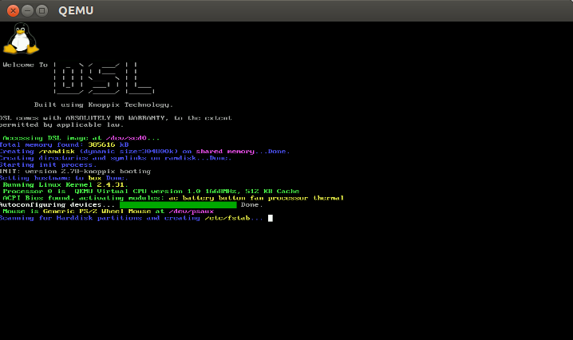
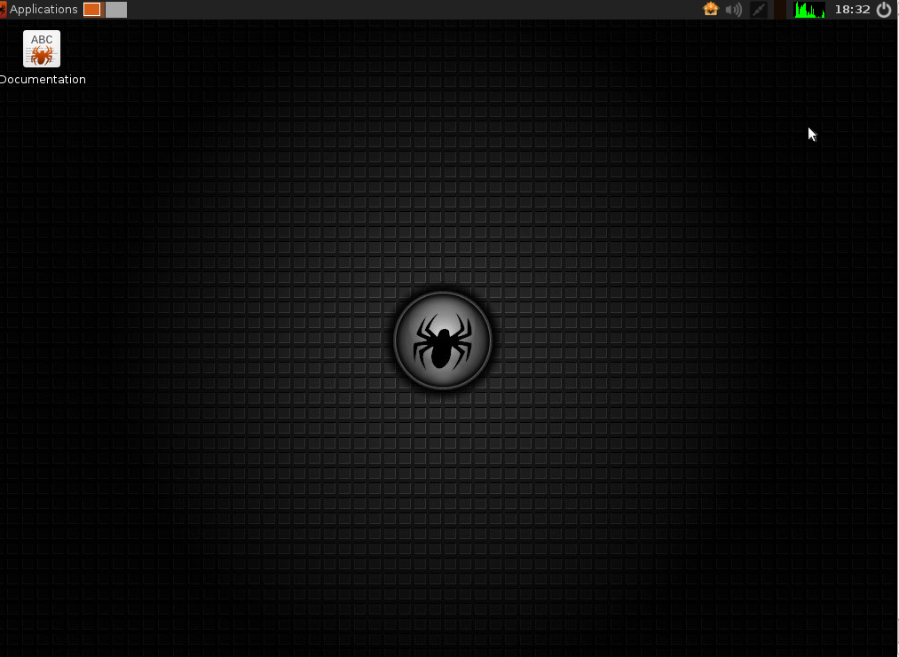
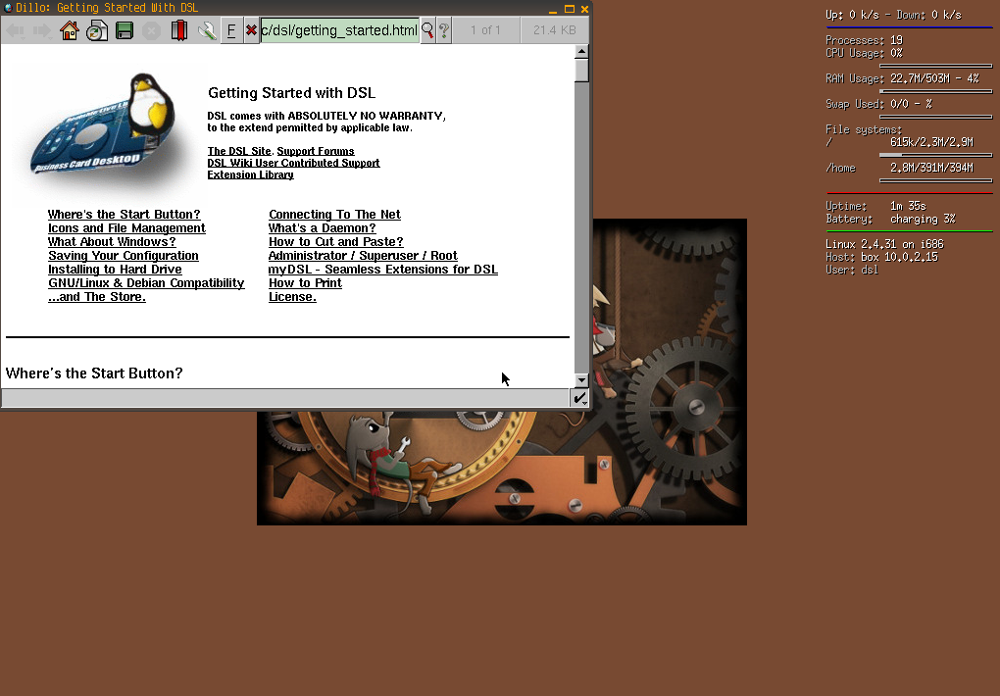

####Ejercicio2

######Crear varias máquinas virtuales con algún sistema operativo libre tal como Linux o BSD. Si se quieren distribuciones que ocupen poco espacio con el objetivo principalmente de hacer pruebas se puede usar CoreOS (que sirve como soporte para Docker) GALPon Minino, hecha en Galicia para el mundo, Damn Small Linux, SliTaz (que cabe en 35 megas) y ttylinux (basado en línea de órdenes solo).

Para crear dos máquina virtuales lo primero que tenemos que hacer es crear los discos duros que necesitarán (como haríamos con virtual box).

~~~bash
qemu-img create -f qcow2 slitaz.qcow2 1G
qemu-img create -f qcow2 dsl.qcow2 1G
~~~

Después montamos la imagen:

~~~bash
qemu-system-x86_64 -hda dsl.qcow2 -cdrom ~/Descargas/dsl-4.11.rc1.iso

qemu-system-x86_64 -hda slitaz.qcow2 -cdrom ~/Descargas/dsl-4.11.rc1.iso
~~~

Pero como nuetra máquina no puede hacer KVM, nos aparece

~~~bash
Could not access KVM kernel module: No such file or directory
failed to initialize KVM: No such file or directory
Back to tcg accelerator.
~~~

Aunque con la opción  `-no-kvm` podemos suplir la carencia pese a la perdida de rendimiento y ver como la imagen carga sin problema:

######Hacer un ejercicio equivalente usando otro hipervisor como Xen, VirtualBox o Parallels.

Vamos a probar un par S.O. en VirtualBox.

[**Slitaz**](http://www.slitaz.org/en/) (<50MB)

Requisitos mínimos e instalación muy rápida.

[**DSL**](http://www.damnsmalllinux.org/download.html) (50MB)

Muy parecida a la anterior.

Como vemos el uso de qemu es muy similiar al de un Hypervisor con GUI.
