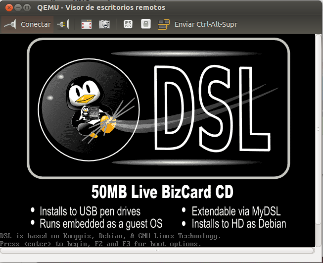

####Ejercicio 4

######Crear una máquina virtual Linux con 512 megas de RAM y entorno gráfico LXDE a la que se pueda acceder mediante VNC y ssh.

Instalamos [vinagre](https://help.ubuntu.com/community/Vinagre) con `sudo apt-get install vinagre`.

Una vez instalado gestionar las máquinas creadas con Qemu es tan fácil como crearlas con la opción **-vnc :n** donde n ser el canal dentro del VNC.

Así por ejemplo haríamos:

~~~bash
> qemu-system-x86_64 -hda dsl.qcow2 -cdrom ~/Descargas/dsl-4.11.rc1.iso -no-kvm -vnc :1
~~~

entonces la máquina empezaría a ejecutarse en segundo plano y para entra en ella sólo tendríamos que hacer:

~~~bash
vinagre localhost:1
~~~

y ya estaríamos dentro, tan fácil como eso.

Realizar la conexión por ssh no debería de ser mucho más complicado, sólo sería necesario levantar la maquina con qemu con la opción `-redir ` especificando tras esta el puerto tcp por el que vamos realizar la conexión (22 para ssh), qudándo algo así
como `-redir tcp:1234::22` para luego realizar la conexión con ssh usando como nombre también localhost. La teoría sería esa pero no consigo hacer que funcione (como a otros compañeros), haciendo que sólo me rechaze la conexión continuamente.

Podemos ver distribuciones con LXDE [aquí](http://wiki.lxde.org/es/Categor%C3%ADa:Distribuciones_de_GNU/Linux).
