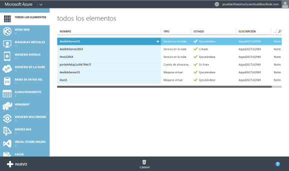
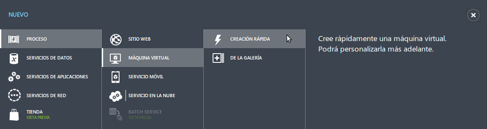
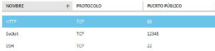
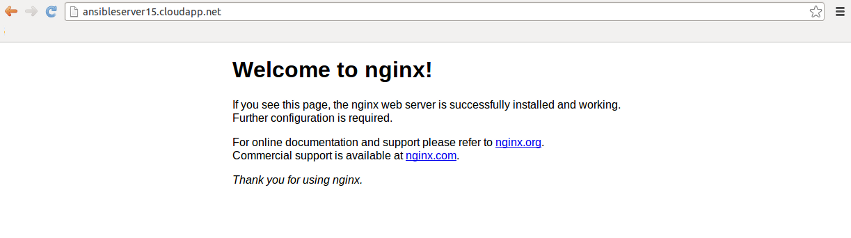

####Ejercicio 5

######Crear una máquina virtual ubuntu e instalar en ella un servidor nginx para poder acceder mediante web.

Vamos a ver de forma rápida como crear una máquina virtual en Windows Azure a través de su portal web.

1.Accedemos al [portal](https://manage.windowsazure.com) con una cuenta previamente activa.

En la imagen podemos ver elementos creados porque ya se ha estado haciendo uso de la plataforma.

2.En el vamos a la sección de maquinas virtualesy y ahí mediante el sencillo menú creamos una con Ubuntu (de la lista de SO disponibles) especificando un usuario y los puertos que queremos tener abiertos.

Por defecto se nos abre el 22 para ssh pero nostros añadimos el 80.

Después realizamos el acceso mediante **ssh** con `ssh <nombre_usuario>@IP` y una vez dentro instalamos **nginx** comprobando que funcione y su versión:

~~~bash
sudo apt-get install nginx
service nginx status
* nginx is running
nginx -v
nginx version: nginx/1.6.2 (Ubuntu)
~~~

Desde ese momento accediendo desde cualquier navegador en cualquier máquina a la dirección de dominio usada en esa máquina podemos ver a nginx funcionando.

La direccion es [ansibleserver15.cloudapp.net](ansibleserver15.cloudapp.net).
