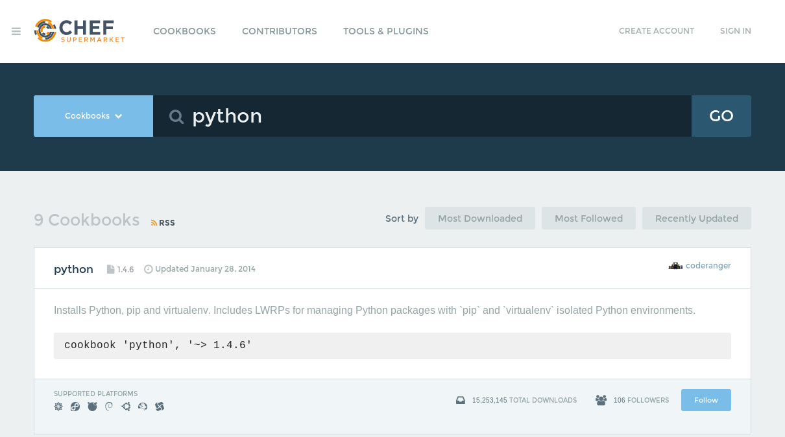

####Ejercicio2

######Crear una receta para instalar nginx, tu editor favorito y algún directorio y fichero que uses de forma habitual.

Usar o más bien probar Chef puede ser lioso si sólo se dispone de una máquina, tenemos que preocuparnos de montar máquinas virtuales y de solucionar la conectividad entre ellas. Para evitar todo eso existe una alternativa, [chef-solo](https://docs.chef.io/chef_solo.html), una versión del cliente de chef que permite el uso de cookbooks en nodos sin necesidad de un servidor (una máquina menos).

Para saber si podemos hacer uso de el (viene incluido en la instalación de chef) hacemos `chef-solo -v
` y nos devuelve `Chef: 12.0.3`.

La idea de chef es reunin de forma simple una serie de instrucciones de instalación para poder mediante una orden simple poner a punto una máquina para realizar algún tipo de trabajo. En el caso de un servidor web, necesitaríamos instalar algún servidor web, algun motor de bases de datos, algún procesador de scripts, etc... Con chef podremos hacer esto de forma simple y replicable en cuantas máquinas queramos.

Para hacer esto necesitamos una estructura mínima, esta la podemos conseguir del repositorio de [opscode] (https://github.com/opscode-cookbooks), creadores de chef, así:

~~~bash
wget http://github.com/opscode/chef-repo/tarball/master
~~~

Cuando descargamos el repositorio entramos en el y tendremos una estructura parecida a esta:

~~~bash
chefignore  cookbooks  environments  README.md
config      data_bags  LICENSE       roles
~~~

Dentro de cookbooks se encuentran los "libros de recetas" que aplicaran las configuraciones que queramos. Estos se manejan con la herramienta [knife](https://docs.chef.io/knife.html) y tenemos que decirle donde se encuentran tras haber descargado el repositorio.

~~~bash
mkdir .chef
echo "cookbook_path [ '/root/chef-repo/cookbooks' ]" > .chef/knife.rb
~~~

Para crear un cookbook usamos knife así:

    knife cookbook create prueba

tras esto no creará la estructura necesaria:

~~~bash
Server> ls cookbooks/
prueba  README.md

Server> ls cookbooks/prueba/
attributes    definitions  libraries    providers  recipes    templates
CHANGELOG.md  files        metadata.rb  README.md  resources
~~~

Ahora es cuando estamos preparados para escribir nuestro libro de recetas. Si no sabemos o queremos usar uno que ya esté escrito con alguna configuración concreta podemos bajarlo del [supermarket](https://supermarket.chef.io/) de Chef.

Por ejemplo podemos buscar los relacionados con instalaciones de python.

y bajarla usando su nombre:

~~~bash
Server> knife cookbook site download python
Downloading python from the cookbooks site at version 1.4.6 to /home/ansibleServer/chef-repo/python-1.4.6.tar.gz
Cookbook saved: /home/ansibleServer/chef-repo/python-1.4.6.tar.gz
~~~

Una vez descargado descomprimimos y vemos los ficheros que ha descargado:

~~~bash
Server> ls
attributes      files         LICENSE        providers  resources
Berksfile       Gemfile       metadata.json  Rakefile   TESTING.md
Berksfile.lock  Gemfile.lock  metadata.rb    README.md  ZPL.txt
CHANGELOG.md    libraries     NOTICE.txt     recipes
~~~

Después ejecutamos:

      sudo chef-solo -c ./metadata.rb

Para personalizar la ejecución y las recetas deberíamos crear dentro de cookbook una carpeta por receta (programa), dentro de esta una carpeta recipes y dentro default.rb donde finalmente se escriben las acciones. En este por ejemplo se escribiría `package 'nginx'` para realizar la instalación de nginx.
