#Ejercicios de Juan Antonio Ruiz.
### Ejercicio 1.
**Consultar en el catálogo de alguna tienda de informática el precio de un ordenador tipo servidor
y calcular su coste de amortización a cuatro y siete años. [Consultar este artículo en Infoautónomos sobre el tema.](http://www.infoautonomos.com/consultas-a-la-comunidad/988)**

Consultando una tabla de amortización en la [página de la agencia tributaria](http://www.agenciatributaria.es/AEAT.internet/Inicio_es_ES/_Segmentos_/Empresas_y_profesionales/Empresarios_individuales_y_profesionales/Rendimientos_de_actividades_economicas_en_el_IRPF/Regimenes_para_determinar_el_rendimiento_de_las_actividades_economicas/Estimacion_Directa_Simplificada.shtml) se puede ver que actualmente el porcentaje máximo que se puede aplicar a "equipos para tratamiento de la información y sistemas y programas informáticos" es del 26% en un periodo máximo de 10 años. Dependerá de lo que le interese a la empresa en cuestión el decidir que porcentaje deducir como amortización cada año.

El precio del [servidor seleccionado](http://fujitsu-shop.anima-its.com/formato-torre/257-servidor-primergy-tx140-s2.html) para este ejercicio es de 1.122€ (IVA incluido) por lo que el precio sin el 21% de IVA sería de 886,38€. Suponiendo que la adquisición la hagamos en enero.

**Amortización a 4 años:**

1. Primer año (26%) 230,46€
2. Segundo año (26%) 230,46€
3. Tercer año (26%) 230,46€
4. Cuarto año (22%) 195,00€

**Amortización a 7 años:**

1. Primer año (26%) 230,46€
2. Segundo año (14%) 124,09€
3. Tercer año (12%) 106,36€
4. Cuarto año (12%) 106,36€
5. Quinto año (12%) 106,36€
6. Sexto año (12%) 106,36€
7. Septimo año (12%) 106,36€

* * *

### Ejercicio 2. 
**Usando las tablas de precios de servicios de alojamiento en Internet y de proveedores de servicios en la nube, Comparar el coste durante un año de un ordenador con un procesador estándar (escogerlo de forma que sea el mismo tipo de procesador en los dos vendedores) y con el resto de las características similares (tamaño de disco duro equivalente a transferencia de disco duro) si la infraestructura comprada se usa sólo el 1% o el 10% del tiempo.**

Comparando costes de [Hostalia](http://www.hostalia.com/dedicados/) desde 99€/mes y [Azure](http://azure.microsoft.com/es-es/pricing/details/virtual-machines/#Windows) con características similares 99,79€/mes (0,1341€/h).

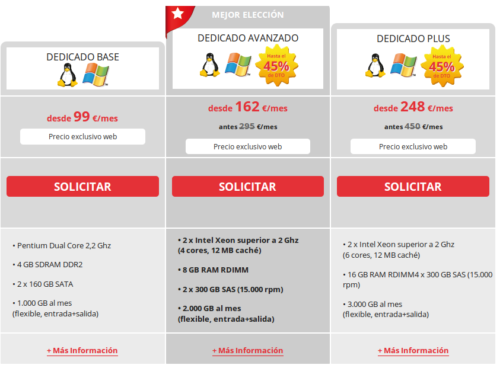
========================================================================
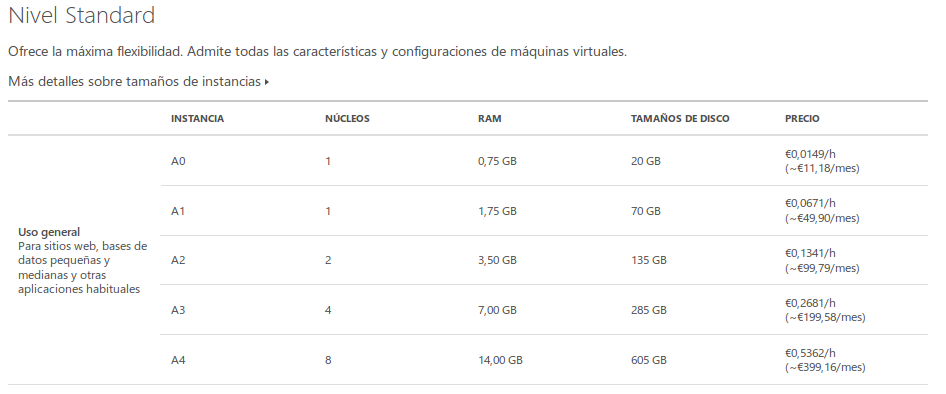

Si se usa la infraestructura un 1%:
- Azure: 99,79€ * 12meses *0.01 = 11,97€/año.
- Hostalia: 99€ * 12meses = 1188€/año independientemente del tiempo que se utilice.

Si se usa la infraestructura un 10%:
- Azure: 99,79€ * 12meses *0.10 = 119,75€/año.
- Hostalia: 99€*12meses = 1188€/año independientemente del tiempo que se utilice.

* * *

### Ejercicios 3.
**1.¿Qué tipo de virtualización usarías en cada caso? Comentar en el foro.**

[Comentario](https://github.com/JJ/GII-2014/issues/71#issuecomment-59784692) realizado en el foro.


**2.Crear un programa simple en cualquier lenguaje interpretado para Linux, empaquetarlo con CDE y probarlo en diferentes distribuciones.**

En caso de no tener CDE instalado, en Ubuntu puede hacerse con el comando:

`` sudo apt-get install cde ``

Para este ejercicio utilizo un programa en python que ordena una lista aleatoria de 10000 elementos con el método de burbuja y muestra el tiempo que emplea en hacerlo cuyo código es el siguiente:

```
#!/usr/bin/python
# -*- coding: utf-8 -*-

import time
import random

# Genera lista de numeros aleatorios.
def generaListaAleatoria():
  tamLista = 10000;

  lista = []

  for i in range(tamLista):
    lista.append(random.randint(0, 10000000));
    
  return lista

# Ordenacion burbuja
def burbuja(lista):
  for i in range(len(lista)):
    for h in range(i, len(lista) - 1):
      if (lista[h] > lista[h+1]):
        aux = lista[h]
        lista[h] = lista[h + 1]
        lista[h + 1] = aux

# lista aleatoria.
lista = generaListaAleatoria()

# print lista1
start = time.clock()
burbuja(lista)
end = time.clock()

# print tiempo empleado en lista.
print "El método de burbuja ha tardado %f segundos" %(end - start)
```

Para empaquetarlo con CDE utilizo:

`` cde ./burbuja.py ``


* * *

### Ejercicios 4. 
**Hacer el tutorial de línea de órdenes de docker para comprender cómo funciona.**
Realizado.

**Avanzado Instalarlo y crear una aplicación contenedorizada**

* * *
### Ejercicio 5. 
**Instala el sistema de gestión de fuentes git**

Captura de pantalla en la que se ve el comando utilzado para instalar git, aunque en mi caso ya lo tenía instalado.
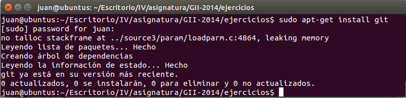

* * *

### Ejercicios 6. 
**1.Crear un proyecto y descargárselo con git. Al crearlo se marca la opción de incluir el fichero README.**

Creo el proyecto:
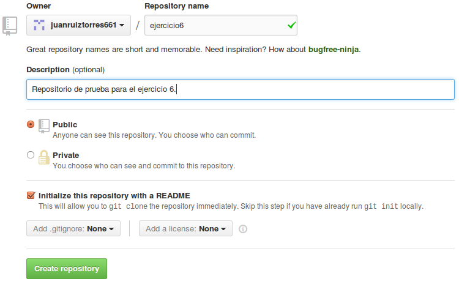
=======================

Descardando el proyecto desde la consola:
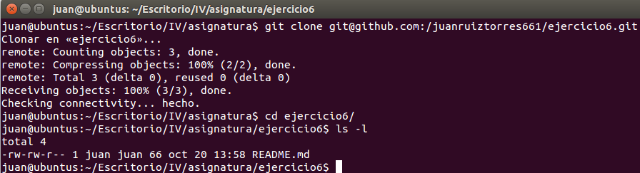
=======================

**2.Modificar el readme y subir el fichero modificado.**

Modificando el fichero README.md desde la consola y subiendo a github.
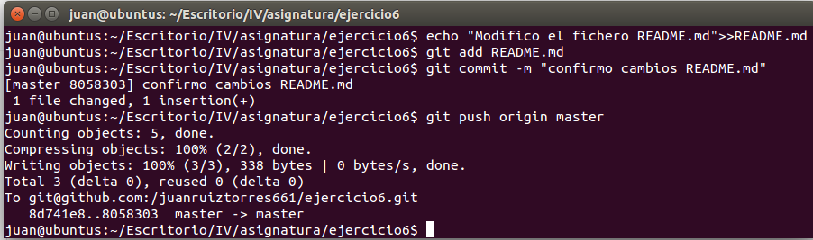

* * *

### Ejercicios 7. 
**Comprobar si en la instalación hecha se ha instalado cgroups y en qué punto está montado, así como qué contiene.**

Verifico que el kernel soporte cgroup:

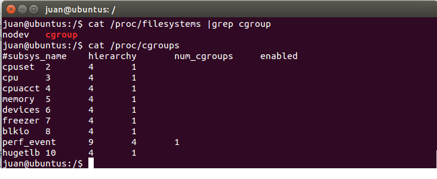
===========================

Comprobando la versión de ubuntu instalada y el contenido de /sys/fs/cgroup que es el punto de montaje por defecto para ubuntu 14.04.
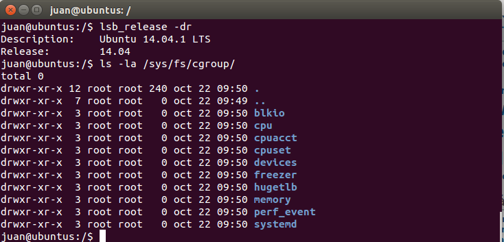
==========================

En mi caso tengo instalado cgroup-lite como puede verse en la siguiente imagen por lo que para crear grupos hay que hacerlo dentro de directorios determinados.

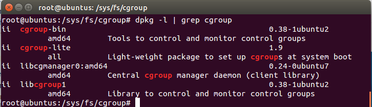
===========================

* * *

### Ejercicios 8. 
**1.Crear diferentes grupos de control sobre un sistema operativo Linux. Ejecutar en uno de ellos el navegador, en otro un procesador de textos y en uno último cualquier otro proceso. Comparar el uso de recursos de unos y otros durante un tiempo determinado.**

**2.Calcular el coste real de uso de recursos de un ordenador teniendo en cuenta sus costes de amortización. Añadir los costes eléctricos correspondientes.**

* * *

### Ejercicios 9. 
**1.Discutir diferentes escenarios de limitación de uso de recursos o de asignación de los mismos a una u otra CPU.**

**2.Implementar usando el fichero de configuración de cgcreate una política que dé menos prioridad a los procesos de usuario que a los procesos del sistema (o viceversa).**

**3.Usar un programa que muestre en tiempo real la carga del sistema tal como htopy comprobar los efectos de la migración en tiempo real de una tarea pesada de un procesador a otro (si se tiene dos núcleos en el sistema).**

**4.Configurar un servidor para que el servidor web que se ejecute reciba mayor prioridad de entrada/salida que el resto de los usuarios.**

* * *

### Ejercicios 10. 
**Comprobar si el procesador o procesadores instalados tienen estos flags. ¿Qué modelo de procesador es? ¿Qué aparece como salida de esa orden?**

Como puede verse en la siguiente captura de pantalla, se trata de un procesador Intel(R) Core(TM) i5-3230M CPU @ 2.60GHz. y como salida de la orden ``egrep '^flags.*(vmx|svm)' /proc/cpuinfo`` no aparece nada puesto que los flags no están en el fichero y por tanto el procesador tiene la funcionalidad desactivada.

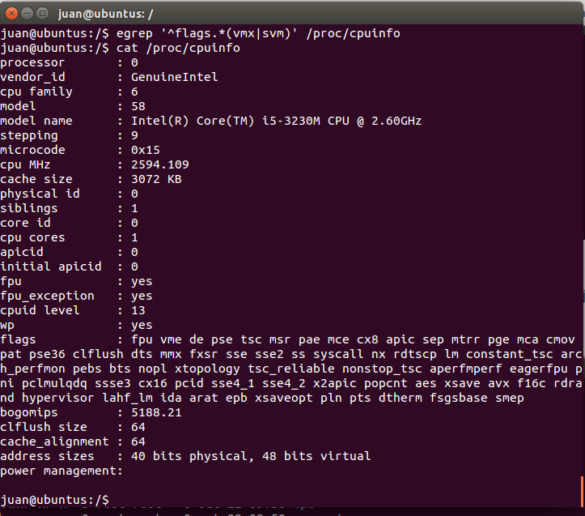


* * *

### Ejercicios 11. 
**Comprobar si el núcleo instalado en tu ordenador contiene este módulo del kernel usando la orden kvm-ok.**
Al encontrarme trabajando desde una máquina virtual, mi configuración hace que no pueda usar KVM.ç

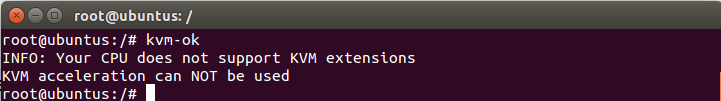

* * *

### Ejercicios 12. 
**Comentar diferentes soluciones de Software as a Service de uso habitual**

* * *


 


