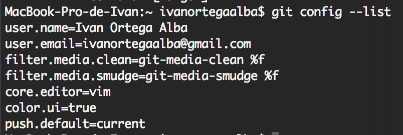

Sesión 29 Septiembre
======================
#Practica 1
##Ejercicio 1

El servidor a amortizar es [HP ProLiant ML310e G8 XE E3-1220/8GB/2TB](http://www.pccomponentes.com/hp_proliant_ml310e_g8_xe_e3_1220_8gb_2tb.html)
Precio: *645€*

Para que esta máquina sea amortizada en el plazo de 4 años, nos ha de dar un 25% de su valor cada año.
Para esto ha de darnos: 645 * 0.25 = 161.25€ por año.

Por tanto, para amortizarlo en 7 años, volvemos a hacer: 645 / 7 = 92.142 € por año.

##Ejercicio 2

Vamos a hacer una comparativa entre 2 servicios de hosting, estos van a ser

##Ejercicio 3

Siguiendo con la tradición, vamos a hacer un "Hola Mundo" para BASH, el nombre del fichero sera HolaMundo.sh:

````````````
#!/bin/bash 
echo "¡Hola mundo!"
````````````

Damos permisos de ejecución ( ```sudo chmod +x ./HolaMundo.sh ```)y ya tenemos listo nuestro script.

Ahora vamos a descargar el CDE e instalarlo. Para ello podemos seguir el [manual oficial](http://sourceforge.net/p/cdesktopenv/wiki/LinuxBuild/).

Para ello, clonamos el repositorio desde:

````````````
git clone http://sourceforge.net/p/cdesktopenv/wiki/LinuxBuild/
````````````
Ahora solo queda ejecutar la instalación y ya tendremos nuestro CDE:

````````````
cd cdesktopenv-code/cde/admin/IntegTools/dbTools
sudo ./installCDE -s /path/to/cdesktopenv-code/cde/
````````````
Para que CDE funcione correctamente, hemos de dar permisos de escritura al directorio:
````````````
sudo chmod -R a+rwx /var/dt
````````````

##Ejercicio 5

La instalación de Git, vamos a hacerla sobre OS X. Git puede instalarse en cualquier SO de los comunes. Yo he escogido OS X, porque on estoy acostumbrado a usarlo para desarrollar y quiero aprender su funcionamiento, que más adelante veremos que es prácticamente igual.
Para instalarlo basta que sigamos el libro oficial de [Git Pro](http://git-scm.com/book/es/Empezando-Instalando-Git).

Hay tres maneras de instalarlo:
- Con el instalador [descargandolo de SourceForge](http://sourceforge.net/projects/git-osx-installer/).
- Con MacPorts:
````````````
sudo port install git-core +svn +doc +bash_completion +gitweb
````````````
- Con Homebrew:
```````````` 
brew install  Git
 ````````````
 En mi caso he optado por la tercera opción, y es simplemente ejecutar ese comando.

 Ahora, hemos de configurar las opciones básicas de Git:
 - Tu identidad:Esto es importante porque las confirmaciones de cambios (commits) en Git usan esta información, y es introducida de manera inmutable en los commits que envías.
 ````````````
$ git config --global user.name "Ivan Ortega"
$ git config --global user.email ivanortegaalba@gmail.com
 ````````````
 - Tu editor: puedes elegir el editor de texto por defecto que se utilizará cuando Git necesite que introduzcas un mensaje, en mi caso prefiero vim.

 ````````````
 $ git config --global core.editor vim
 ````````````
 Además, a mi personalmente, cuando saque información, me gusta que me la dé en color.
 ```
$ git config --global color.ui true
 ```
Finalmente podemos comprobar nuestra información con:
 ````````````
$ git config --list
 ````````````


